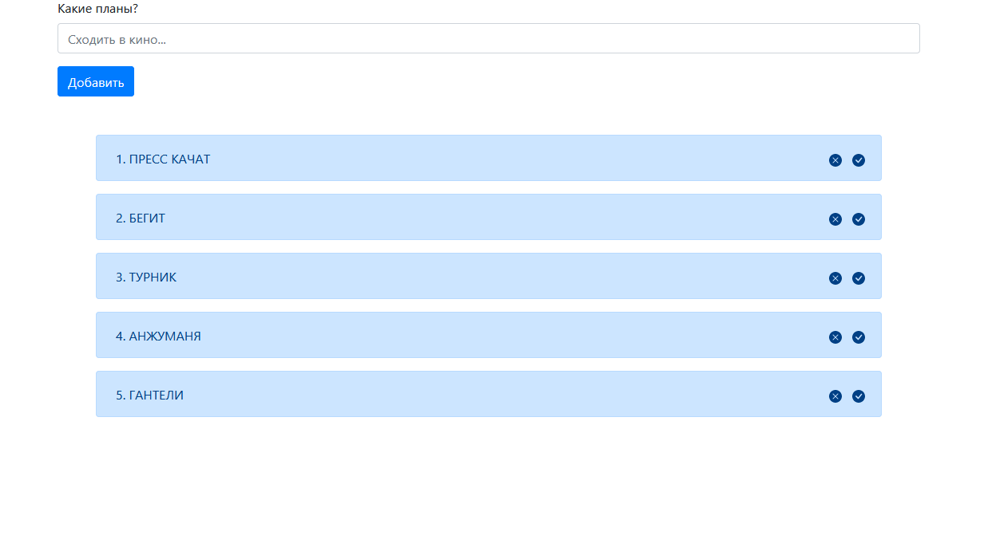

# react-webpack5-redux-todo
Добро пожаловать. Тут ничего необычного, простая тудушка. При создании я применил технологии: bootstrap, react, redux(библиотеки: ract-redux, redux-actions).
Она со временем будет развиваться, и дополняться новым функционалом.

Установка:
1. Склонируйте локально репозиторий.
2. Пропишите в консоли находясь той дирректории, которую склонировали репозиторий следующие команды:
npm install
npm run build
npm run dev
Тогда в браузере откроится окно с тудушкой. Если окно не открылось, то в любом браузере нужно в адресную строку вбить: http://localhost:8080/.

​

Базовый функционал: 
Добавлять задачи,
Удалять по клику на крестик,
Отмечать выполнеными по клику на галочку, и обратно по клику на соответствующую иконку.
